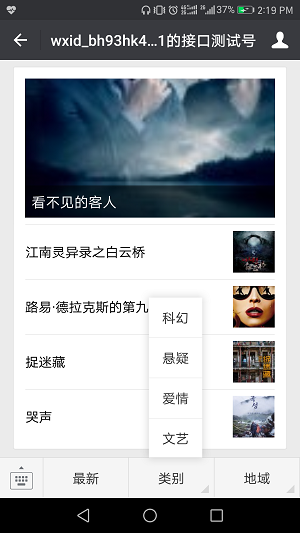

## wemovie

> 基于nodejs的微信公众号开发，打造一个电影推荐系统。

### 1.系统介绍
wemovie系统拟爬取飘花电影网的内容，形成图文消息，推送到微信公众号。

### 2.系统预期功能
- 新关注自动回复；
- 被动回复；
- 推送文字消息；
- 推送图文消息；
- 推送语音消息；
- 自定义菜单；
- 语音搜索；
- 爬取电影网站最新电影资讯；
- 在公众号推送电影咨询。

### 3.使用说明
1. `git clone` 到本地，`cd` 进入 `wemovie` 目录， `npm install` 安装依赖；
2. 进入微信公众平台->开发者工具->公众平台测试账号，复制测试账号的 `appaID` 和 `appsecret` 信息，替换掉 `config.js` 里面的对应信息；
3. 安装 `localtunnel` ，新建命令行窗口 `lt --port 8080` 启动；
4. 复制 `localtunnel` 启动后产生的 `url` 地址，修改接口配置信息；
5. 开始测试。

### 4.注意点 
- `localtunnel` 很不稳定，一言不合就会挂掉，请多点耐心，或者另谋生路；
- 如果出现错误提示：...node_modules\cheerio\lib\parse.js:55，说明飘花网对此类爬虫请求已经做出屏蔽，试试爬取别的网站吧。

### 5.补充说明
目前处于持续更新中，欢迎star、fork。相关博客地址：[nodejs微信公众号开发](https://segmentfault.com/a/1190000008976225)